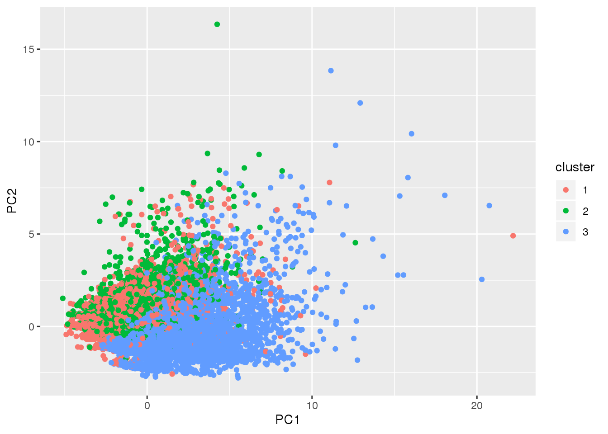
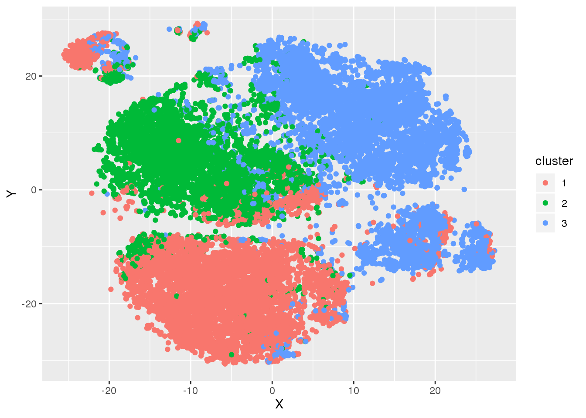
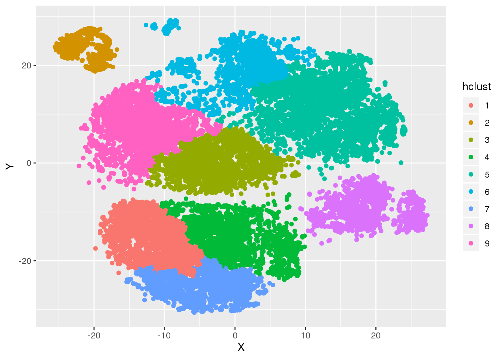
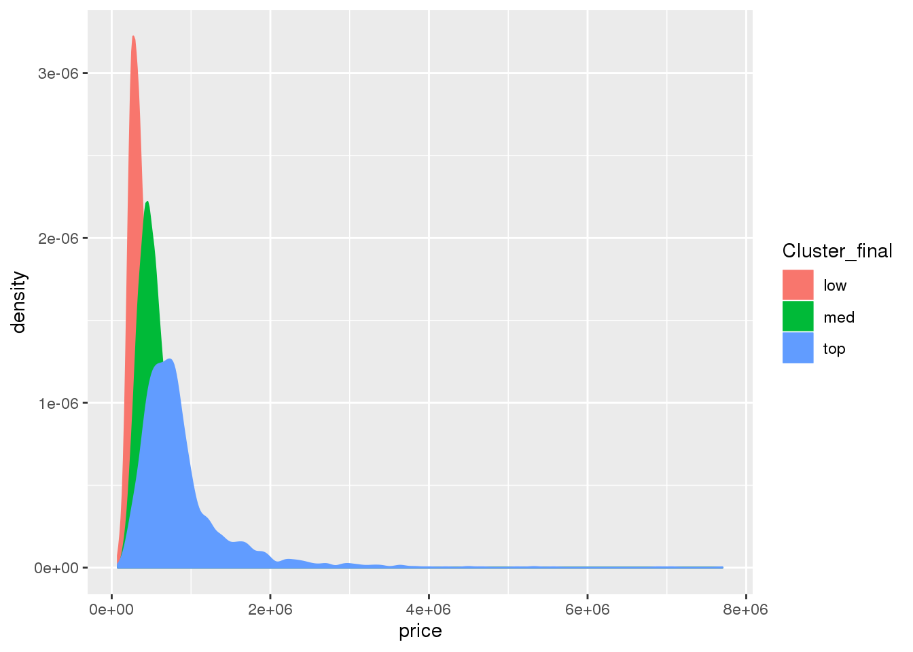
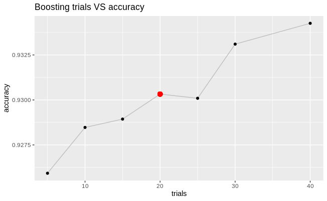
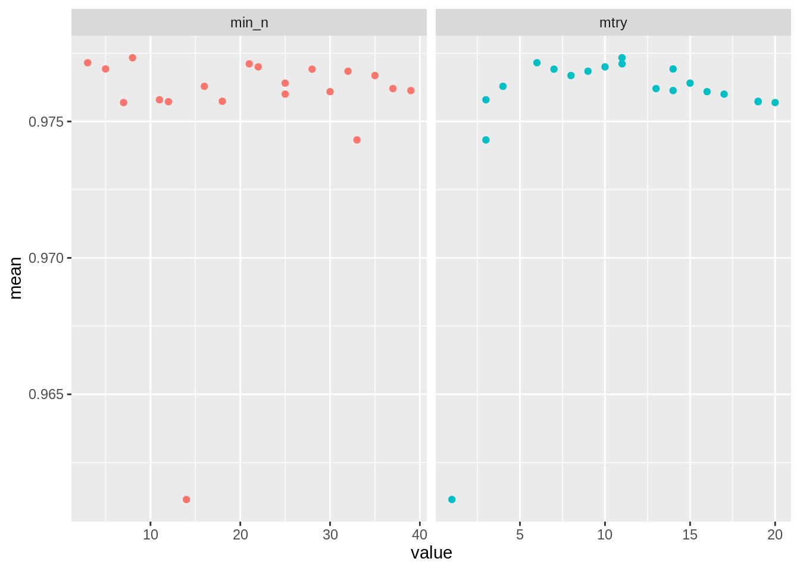

<style type="text/css">

.list-group-item.active, .list-group-item.active:focus, .list-group-item.active:hover {
    z-index: 2;
    color: #fff;
    background-color: #384754;
    border-color: #384754;
}

h1, h2, h3, h4 {
color: #384754
}

p {
color: #3E4D5B
}

.back-home {
font-size: 25px;
}

a {
color: #2B6390;
}

.share-buttons{
  text-align: center;
  display: inline-block;
  border-radius: 20px;
  border: 2px solid #384754;
  width: 150px;
  height: 40px;
}

#nav_logo {
  width: 100%;
  margin-top: 20px;
}

</style>

---


```{r, include=F}
split_data <- function(data, trn = .7, val = .2, tst = .1) {
  set.seed(737)
  spec = c(train = trn, validate = val, test = tst)
  # cutter
  g = sample(cut(seq(nrow(data)), nrow(data)*cumsum(c(0,spec)), labels = names(spec)))
  # spliter
  data <- split(data, g)
  return(data)
}
```


# Carga de librerías
A continuación mostramos las librarías necesarias para la ejecución de nuestra práctica.
```{r, echo=F, warning=F, collapse=False, include=F}
# Basics
library(dplyr)
library(ggplot2)
library(tidyr)
library(tictoc)
library(kableExtra)
library(gmodels)
library(tidymodels)

# Load the sp package
library(tidyverse)
library(sp)
library(leaflet)
library(Hmisc)
library(gridExtra)
library(grid)
library(lattice)
library(caret)

library(cluster)
library(dplyr)
library(ggplot2)
library(readr)
library(factoextra)
library(Rtsne)
library(caret)
library(lattice)
library(glmnet)
library(pscl)
library(ROCR)
library(VarReg)
library(mgcv)
library(brew)
library(bsplus)
library(DMwR2)
library(car)
library(carData)
library(caret)
library(cluster)
library(dplyr)
library(egg)
library(expss)
library(factoextra)
library(gclus)
library(GGally)
library(ggplot2)
library(ggpubr)
library(gridExtra)
library(Hmisc)
library(htmltools)
library(kableExtra)
library(knitr)
library(magrittr)
library(mlbench)
library(RColorBrewer)
library(readr)
library(Rtsne)
library(tidyr)
library(tidyverse)
library(VIM)
library(scales)
library(plyr)
library(PerformanceAnalytics)
library(corrplot)
library(leaps)
library(plotly)
library(mboost)
library(nnet)
library(stargazer)
```

# Carga de los datos
En este apartado realizamos la carga y muestra de todos los datos que vamos a usar a lo largo de la práctica.
Lo datos se dividen en 3 grupos:
- Train: supone el 70% del total de la muestra y lo usaremos para entrenar todos los modelos.
- Validación: supone el 20% del total de la muestra y lo usaremos para comprobar el rendimiento de los modelos.
- Test: supone el 10% del total de la muestra y lo usaremos exclusivamente en el modelo seleccionado tras la evaluación de modelos.

Para los modelos de clasificación hemos separado la variable target de precio a partir del quantil 75 que divide el precio en los 675 000$ en dos clases, 0 cuando es menor y 1 cuando es mayor.
```{r, warning=F}
file <- 'cluster.csv'
df <-  read.csv(file)
df_houses <- df
quantile <- df_houses$price %>% quantile(0.75)
df_houses$target <- ifelse(df_houses$price>quantile, 1, 0) %>% as.factor()
df_houses <- df_houses %>% select(6, 8:25, 28:29)
head(df_houses) %>% kable() %>% kable_styling() %>% scroll_box(width = "100%", height = TRUE)

#spliting data
data <- split_data(df_houses)
train <- data$train
validation <- data$validate
test <- data$test


x_train <- train[, 1:(ncol(train)-1)]
y_train <- train[, (ncol(train))] %>% as.factor()
x_val <- validation[, 1:(ncol(train)-1)]
y_val <- validation[, (ncol(train))] %>% as.factor()
```


## 1 Introduccion

Para la práctica hemos seleccionado una base de datos obtenida de Kaggle con los precios de viviendas del barrio King County en el estado de Washington (EEUU). Esta base de datos es de dominio público y consta de 21 variables con 21.613 observaciones.

La base de datos puede descargarse en el siguiente enlace: https://www.kaggle.com/swathiachath/kc-housesales-data

Nos hemos puesto en la piel de supuestos clientes, para este caso en particular inmobiliarias de lujo, que desean hacer una correcta estimacion de si un piso que desean adquirir o vender entra en la clasificacion de piso de lujo.

## 1.1 Mapa de los pisos
Uno de los detalles importantes consiste en ver como se distribuyen los pisos en la zona:
```{r, warning=F, echo=F, message=F}
getClass("Spatial")
coords <- select(df, long, lat, price)

housingMap <- leaflet(coords) %>%
  addTiles() %>%
  addCircleMarkers(lng = ~long,
             lat = ~lat, radius = 3, stroke = F, fillOpacity = 0.4, color = "#1f4068")

housingMap
```

Como podemos observar la cantidad de viviendas registradas en la base de datos están distribuidas desigualmente por el territorio, lo que sugiere que en nuestros datos tendremos tipologías muy distintas. A raíz de la visualización anterior nos surgen las siguientes preguntas:

- ¿Cuales de estas viviendas tienen el precio ajustado al mercado?
- ¿Estamos comprando una vivienda por un valor sobre el mercado?
- ¿Estan mis potenciales clientes en primera vivienda o están interesados en la puesta en alquiler?

Nuestra solucion intenta responder a estas preguntas mediante machine learning. A continuacion aplicaremos distintas soluciones para dar con la más adecuada al problema que se nos plantea.

## 1.2 Variable precio

```{r var_price, warning=FALSE}
#Obtención de variables cuantitativas
phist <- function(df, bns = 50, varname) {
  p = ggplot(df, aes(x = df[[varname]])) + 
    geom_histogram(aes(y =..density..), 
                   colour = "#464159", 
                   fill = "#8bbabb", na.rm = TRUE) + 
    ggtitle("Diagrama Boxplot") + 
    ylab("Densidad") + xlab(varname) + 
    scale_x_continuous(labels = scales::comma) +
  stat_function(fun = dnorm, args = list(mean = mean(df[[varname]]), sd = sd(df[[varname]])))
return(p)
}

pbox <- function(col, varname){
p = qplot('1', col, geom="boxplot") +
  geom_boxplot(fill='#8bbabb', color="#464159") +
  ggtitle("Diagrama Boxplot") + ylab("Valores") + xlab(varname)
return(p)
}
# Descripción de la variable
describe(df$price)

# Visualización de la variable
p1 <- phist(df, ., 'price')
p2 <- pbox(df$price, 'price')
grid.arrange(p1, p2, nrow=1)
```

---

# 2 Cluster análisis
Dada la complejidad y dispersión de nuestra base de Datos de casas, desde el departamento comercial nos solicitan una primera segmentación de la cartera para facilitar la comprensión y operatividad de la misma. Para ello desde el departamento de Analítica planteamos realizar dentro de las técnicas no supervisadas un Análisis Cluster en 3 grandes grupos que nos permite segmentar de forma óptima alrededor de la variable precio.

*Distancia de Gower*
Nuestra base de datos al estar compuesta por variables continuas, oridinales y categóricas decidimos emplear al   Distancia de Gower para el posterior Clustering.
Es una medida numérica de cuan separados están los items de nuestra base de Datos.


*Algoritmo PAM*
Una vez calculada la matriz de distancia emplearemos el algoritmo PAM, basado en una partición de medoids. Es un método muy similar a k-means, pero es mucho más robusto a la presencia de Outliers como es en nuestro caso. Es un procedimiento de agrupación iterativa.


## 2.1 Selección del Número de Clúster y respresentación en un PCA

A fín de manejar de forma viable la segmentación seleccionamos 3 clusters, que sin ser el número óptimo facilitado por el algoritmo es el número propuesto desde el departamento comercial para optimizar adecuadamente sus recurcos.
Una vez seleccionado el número de Clusters vamos a representarlos en un plano mediante una técnica de reducción de la dimensionalidad Lineal el PCA.
Obteniendo la siguiente representación.

```{r reduccion del codigo}
# df_mas <- read.csv ("kc_house_data.csv")
# # Uncomment if fails
# df_mas$date <- as.factor(df_mas$date)
# 
# gower_dist <- daisy(df_mas, metric = "gower")
# 
# sil_width <- c(NA)
# for(i in 2:3){  
#   pam_fit <- pam(gower_dist, diss = TRUE, k = i)  
#   sil_width[i] <- pam_fit$silinfo$avg.width  
# }
# 
# set.seed=737
# k <- 3
# pam_fit <- pam(gower_dist, diss = TRUE, k)
# pam_results <- df_mas %>%
#   mutate(cluster = pam_fit$clustering) %>%
#   group_by(cluster) %>%
#   do(the_summary = summary(.))
# 
# data<- subset(df_mas, select=c("price", "bedrooms","bathrooms","sqft_living","sqft_lot","floors","waterfront",                                        "view","condition","grade","sqft_above","sqft_basement","sqft_living15","sqft_lot15"))
# pca<- prcomp(data, scale=TRUE)
# 
# pam_fit$clustering <- as.character(pam_fit$clustering)
# pca_data <- data.frame(pca$x, cluster=pam_fit$clustering)
# 
# ggplot(pca_data, aes(x=PC1, y=PC2, color=cluster)) + geom_point()

```

Vemos que esta representacón no es satisfactoria ya que existe mucha superposición en los clustering y visualmente no percibimos grandes diferencias.
Por ello vamos a plantear una alternativa al PCA pero para datos no lineales, el TSNE.

## 2.2 TSNE

Algoritmo de reducción de dimensionalidad no lineal, encuentra patrones en los datos mediante la identificación de grupos observados basados en la similitud de puntos de datos con múltiples características.
Asigna los datos multidimensionales creados en la Distancia de Gower anteriormente calculada a un espacio dimensional menor.
Nos va a permitir usando la Distancia de Gower la representación de nuestros clusters creados por el Algoritmo PAM.

```{r tsne}
# set.seed=737
# tsne_obj <- Rtsne(gower_dist,perplexity = 80, is_distance = TRUE)
# tsne_data <- tsne_obj$Y %>%
#   data.frame() %>%
#   setNames(c("X", "Y")) %>%
#   mutate(cluster = factor(pam_fit$clustering))
# 
# ggplot(aes(x = X, y = Y), data = tsne_data) +
#   geom_point(aes(color = cluster))
```

Y vemos efectivamente  en la reprfesentación de TSNE que existen relaciones No lineales entre nuestros datos y con esta técnica conseguimos posicionar e identificar de una manera mucho más concreta y detallada un mayor número de clusters.
En nuestra representación de los 3 clusters del PAM vemos se han agrupado diferentes casas que vemos con la representación del TSNE podrían ser considerados como nuevos grupos por lo que vamos plantear un nuevo análisis jeráquico en función de los ejes de TSNE.

## 2.3 Hierarchical clustering
Agrupaciones de Clusters anidados de forma Aglomerativa dentro del plano XY del TSNE.
Obtenemos la siguiente representación:

```{r Cluster Jeraquico}
# set.seed(767)
# cluster_hierarchical=hclust(dist(tsne_obj$Y), method = "ward.D")
# df_join<-cbind(tsne_data,df_mas)
# df_join$hclust = factor(cutree(cluster_hierarchical, 9))
# prueba <- subset( df_join, select = -cluster )
# ggplot(aes(x = X, y = Y), data = prueba) +
#   geom_point(aes(color = hclust))
```


A partir de estos Clusters jerárquicos vamos a reagrupar en 3 grandes Clusters en función de la variable Precio obteniendo:

```{r Cluster final}
# df_cluster <- read.csv ("cluster.csv")
# 
# #descriptivo en cada Clúster
# set.seed(767)
# df_cluster %>%
#         group_by(hclust) %>%
#         summarise(num_casas=n(), precio_medio= mean(price), room=mean(bedrooms),baths=mean(bathrooms) ,
#                   tamanyo=mean(sqft_living), anyo=floor(mean(yr_built)) ,grade=mean(grade), condicion=mean(condition),        visitas=mean(view))
# 
# 
# 
# df_cluster$hclust=as.numeric(df_cluster$hclust)
# df_cluster$Cluster_final[df_cluster$hclust==2 | df_cluster$hclust==8] <- "top"
# df_cluster$Cluster_final[df_cluster$hclust==1 | df_cluster$hclust==5 | df_cluster$hclust==9] <- "low"
# df_cluster$Cluster_final[df_cluster$hclust==3 | df_cluster$hclust==4 | df_cluster$hclust==6 | df_cluster$hclust==7  ] <- "med"
# 
# 
# 
# df_cluster %>%
#         group_by(Cluster_final) %>%
#         summarise(num_casas=n(), precio_medio= mean(price), room=mean(bedrooms),baths=mean(bathrooms) ,
#                   tamanyo=mean(sqft_living), anyo=floor(mean(yr_built)) ,grade=mean(grade), condicion=mean(condition),visitas=mean(view))
# 
# ggplot(df_cluster, aes(x=price, fill=Cluster_final, color=Cluster_final)) +
#   geom_histogram(aes(y=..density..), binwidth=3)+  geom_density(aes(color=Cluster_final)) 

```

---

# 3 Entrenamiento de modelos
## 3.1 Modelos GLM
### Modelos GLM. Regresión Logistica (Logit)

En función del Target 1/0 con la función link logit
Regularización Lasso

```{r Regresión Logistica (Logit)}

train_glm1 = glm(target ~ floors + grade + condition + view + sqft_above + yr_built + sqft_living15 + Cluster_final , 
               family = binomial,
               data = train )
summary(train_glm1)
predictions <- predict(train_glm1, validation,type='response')
data = as.numeric(predictions>0.5)
data=as.factor(data)
y_test=as.factor(validation$target)

# use caret and compute a confusion matrix
confusionMatrix(data, y_test)

```


### Modelos GLM. Regresión Logistica (Probit)

En función del Target 1/0 con la función link Probit
Regularización Lasso

```{r Regresión Logistica (Probit)}
train$yr_built=as.numeric(train$yr_built)

model_probit1 = glm(target ~ floors + grade + condition + view + sqft_above + yr_built + sqft_living15 + Cluster_final , 
               family = binomial (link="probit") ,
               data = train )
summary(model_probit1)
predictions <- predict(model_probit1, validation,type='response')
data = as.numeric(predictions>0.5)
data=as.factor(data)
y_test=as.factor(validation$target)

# use caret and compute a confusion matrix
confusionMatrix(data, y_test)

```

## 3.2 SVM Kernel PolyNomial
En función del Target 1/0 
Dummy variable Categorica Cluster Final
Cálculo de Hiperparámetros 
SVM Kernel Polynomial 

```{r Preprocessing SVM}
library(fastDummies)
df_cluster_dummies <- dummy_cols(train,select_columns =c ("Cluster_final"))
df_cluster_dummies_validation <- dummy_cols(validation,select_columns =c ("Cluster_final"))


myvars <- c('bedrooms' ,'bathrooms' ,'sqft_living', 'sqft_lot' ,'floors' ,'waterfront' ,'view' ,'condition' ,'grade' ,'sqft_above' ,'sqft_basement','yr_built', 'yr_renovated','sqft_living15' ,'sqft_lot15' ,'target' ,'Cluster_final_med', 'Cluster_final_low', 'Cluster_final_top')

train_svm <- df_cluster_dummies[myvars]
validate_svm <- df_cluster_dummies_validation[myvars]

```


```{r SVM Polinomial }

#modelo_svm <- svm(target ~ ., data = train_svm, 
#                  type='C-classification',
#                  kernel = "polynomial", 
#                  cost = 3.3,
#                  gamma= 7.5,
#                  iter.max=1,
#                  scale = TRUE)

svm_results <- read.csv('salida_svm.csv')
table_validation <- CrossTable(x = y_val, y = svm_results$y_pred, prop.chisq = FALSE)
# table_validation
accuracy <- sum(diag(table_validation$t))/sum(table_validation$t)
output = sprintf("The validation accuracy of the KNN model is: %s", accuracy)
print(output)
```

## 3.3 KNN
Para poder entrenar este modelo hemos usado solo las variables numéricas, las cuales hemos escalado mediante un K-score para evitar rebasamientos en minimos y máximos de la escala con la muestra de validación.

### Transformación de los datos
```{r}
df_knn <- df_houses
df_knn$date <- df_knn$date %>% as.Date("%m/%d/%Y") %>% format("%Y") %>% as.integer()
df_houses_nk <- as.data.frame(scale(df_knn[, 0:19]))
df_houses_nk$target <- df_knn$target
head(df_houses_nk) %>% kable() %>% kable_styling() %>% scroll_box(width = "100%", height = TRUE)
```
### Entrenamiento del modelo
Para definir un k inicial se propone un k inicial de la raíz cuadrada del número de elementos que hay en nuestra tabla. Para evitar empates en la votación se forzará a que K se un número siempre impar.
```{r}
load('Models/first_knn_pred.rda')
table_validation <- CrossTable(x = y_val, y = first_knn_pred, prop.chisq = FALSE)
# table_validation
accuracy <- sum(diag(table_validation$t))/sum(table_validation$t)
output = sprintf("The validation accuracy of the KNN model is: %s", accuracy)
print(output)
```

### Mejoras
Tras realizar las técnicas de cross validation, bootstraping y fixed set nos quedamos con la opción que menor error produce en validation dando como resultado el siguiente modelo con un K = 11.
```{r}
load('Models/knn_pred.rda')
table_validation <- CrossTable(x = y_val, y = knn_pred, prop.chisq = FALSE)
# table_validation
accuracy <- sum(diag(table_validation$t))/sum(table_validation$t)
output = sprintf("The validation accuracy of the KNN model is: %s", accuracy)
print(output)
```


## 3.4 Árbol de decisión

### Transformación de datos
Para el entrenamiento del arbol de decisión hemos convertido las variables categóricas en ordinales.
```{r}
load('Models/df_tree.rda')
data <- split_data(df_tree)
train <- data$train
validation <- data$validate
test <- data$test

x_train_t <- train %>% select(-target)
y_train_t <- train$target
x_val_t <- validation %>% select(-target)
y_val_t <- validation$target
head(df_tree) %>% kable() %>% kable_styling() %>% scroll_box(width = "100%", height = TRUE)
```
### Entrenamiento del modelo
Entrenamos el árbol sobre training. Obtenemos un árbol de decisión con 121 niveles de profundidad.
Evaluation on training data (12958 cases):

	    Decision Tree   
	  ----------------  
	  Size      Errors  

	   121  766( 5.9%)   <<


	   (a)   (b)    <-classified as
	  ----  ----
	  9481   249    (a): class <p75
	   517  2711    (b): class >p75


	Attribute usage:

	100.00%	grade
	 99.63%	lat
	 84.04%	waterfront
	 61.48%	sqft_living
	 50.73%	zipcode
	 47.71%	view
	 21.15%	long
	 21.02%	yr_built
	  8.90%	yr_renovated
	  8.81%	condition
	  6.72%	sqft_above
	  4.19%	sqft_lot15
	  3.72%	bathrooms
	  3.61%	Cluster_final
	  3.56%	date
	  2.29%	bedrooms
	  2.27%	sqft_living15
	  2.05%	sqft_lot
	  0.69%	sqft_basement
	  0.23%	floors
	  
Podemos ver que las 3 variables que más condicionan la clasificación del modelo son la variable *grade* o nota del estado del inmueble la latitud *lat* y si tiene o no vistas a lago o mar.

### Mejoras del modelo
La función c5.0() nos permite añadir boosting al árbol de decisión mediante el parámetro *trials*. *trials* limita el número de árboles añadidos. Un buen parámetro estándar inicial reconocido para boosting es de 10, ya que algunas investigaciones situan la reducción del error en un 25%. En este caso, ya que el modelo tarda muy poco en ejecutarse probaremos 7 valores diferentes de boosting.

```{r}
load('Models/tree_pred.rda')
table_train <- CrossTable(y_val_t, tree_pred, prop.chisq = FALSE, prop.c = FALSE, prop.r = FALSE, dnn = c('Actual', 'Precicted'))
accuracy <- sum(diag(table_train$t))/sum(table_train$t)
sprintf("The accuracy of the RF on Validation is: %s", accuracy)
```


## 3.5 Modelo Random Forest
Para entrenar el modelo random forest nos hemos apoyado en los siguientes parámetros:
- ntree: número de árboles o de votantes a entrenar para cada observación.
- mtry: numero de parámetros aleatorios a combinar para cada árbol.
- nodes: numero mínimo de observaciones que debe quedar en una hoja.

### Transformación de los datos
Para poder realizar el entrenamiento del modelo hemos transformado los datos categóricos a ordinales siempre que fuera posible
```{r}
df_rf <- df_houses
# Date as year
df_rf$date <- df_rf$date %>% as.Date("%m/%d/%Y") %>% format("%Y") %>% as.integer()
levels(df_rf$Cluster_final) <- c('1', '2', '3')
# Cluster as ordinal
df_rf$Cluster_final <- df_rf$Cluster_final %>% recode_factor('low' = 1, 'med' = 2, 'top' = 3)
head(df_rf) %>% kable() %>% kable_styling() %>% scroll_box(width = "100%", height = TRUE)
```

### Entrenamiento del modelo
Los parámetros principales para entrenar el random forest son:
- ntree: número de árboles o de votantes a entrenar para cada observación.
- mtry: numero de parámetros aleatorios a combinar para cada árbol.
- nodes: numero mínimo de observaciones que debe quedar en una hoja.

### Mejora del modelo
Para conseguir una mayor precisión en el ajuste del modelo hemos usado un k-fold cross validation de 10 sobre un Grid search aleatorio de 20 iteraciones, obteniendo de esta manera una primera idea de los rangos de parametros en los que debemos movernos.

Posteriormente realizamos un segundo k-fold cross validation de 5 con un mtry situado entre 5 y 15 y un min_n entre 2 y 8 que es donde situan el modelo con mejores resultados.

### Resultados
```{r}
print(load('Models/model_rf.rda'))
best_rf
```

```{r}
pred <- predict(best_rf, x_val)$.pred_class
table_train <- CrossTable(y_val, pred, prop.chisq = FALSE, prop.c = FALSE, prop.r = FALSE, dnn = c('Actual', 'Precicted'))
accuracy <- sum(diag(table_train$t))/sum(table_train$t)
output= sprintf("The accuracy of the RF on Validation is: %s", accuracy)
print(output)
```


## 3.1 Modelo GAM. Variable Dependiente Precio Continua

Como pudimos comprobar en el trimestre anterior los tradicionales modelos lineales a menudo fallan cuando planteamos problemas no lineales que suele ser lo habitual en la vida real. Con esta técnica queremos identificar los efectos no lineales de nuestros dantos dentro de un modelo predictivo de regresión.

```{r GAM Price}
set.seed(737)
inTraining <- createDataPartition(df$id, p = .7, list = FALSE)
gamtrain    <- df[inTraining,]
gamcontrol  <- df[-inTraining,]

model_gam3 <- gam (sqrt(price)~ s(lat,long,k=20) +s(sqft_living,k=8)  +s(sqft_living15) + s(bathrooms,k=8)  + s(grade,k=3)   +(waterfront) +   s(view,k=3) + s(yr_built) , data=gamtrain, method="REML")

summary(model_gam3)
```


## 3.2 Modelo GAM. Variable Dependiente Binary

En función del Target 1/0 con la función link logistica
Regularización Lasso

```{r GAM Binary}
trn      <- read.csv ("validation.csv")
valn <- read.csv ("validation.csv")
# Modelo
trn$Cluster_final <- trn$Cluster_final %>% as.factor %>% relevel(ref = "med")
model_gam_log2 <- gam(target~ s(lat,long) +s(sqft_living) + s(grade) + s(sqft_above)  + s(yr_built) + s(sqft_living15) +floors+ s(view,k=3) + condition + Cluster_final,
                       data=trn, family =  binomial("logit"), method="REML")

  

summary(model_gam_log2)
```

```{r matriz confuson GAM Binary}
predictions_val <- predict(model_gam_log2, valn,type='response')
data = as.numeric(predictions_val>0.5)
data=as.factor(data)
y_test=as.factor(validation$target)

# use caret and compute a confusion matrix
confusionMatrix(data, y_test)
```

# 4 Evaluación de modelos
## 4.1 Cargando resultados de los modelos
```{r}
# Importando GLM logit
load('Models/glm_logit_pred.rda')
glm_logit_pred <- glm_probit_pred
load('Models/glm_probit_pred.rda')
table(glm_logit_pred)
table(glm_probit_pred)
# Importando KNN
load('Models/knn_pred.rda')
table(knn_pred)
# Importando Árbol de decisión
load('Models/tree_pred.rda')
table(tree_pred)
# Importando Random Forest
load('Models/rf_pred.rda')
table(rf_pred)
# Importando GAM
load('Models/gam_pred.rda')
table(gam_pred)
```

---

## 4.2 Cálculo de errores
En este apartado vamos a calcular con diferentes métricas el error de los modelos con el fín de seleccionar el que mejor se adapta a nuestros datos, para ello nos vamos a ayudar de la librería *MLmetrics*.
```{r, include=F}
get_errors <- function(name, y_true, y_pred, y_prob, positive = '1') {
  library(MLmetrics)
  library(vcd)
  acc <- Accuracy(y_pred, y_true)
  f1 <- F1_Score(y_true, y_pred, positive = positive)
  # rmse <- RMSE(y_pred, y_true)
  # r2 <- R2_Score(y_pred, y_true)
  rocauc <- AUC(y_pred, y_true)
  lift <- LiftAUC(prob, y_true)
  gain <- GainAUC(prob, y_true)
  spec <- Specificity(y_true, y_pred, positive = positive)
  sens <- Sensitivity(y_true, y_pred, positive = positive)
  prec <- Precision(y_true, y_pred, positive = positive)
  rec <- Recall(y_true, y_pred, positive = positive)

  errors <- data.frame(model = name, accuracy = acc, f1score = f1, roc_auc = rocauc, lift_auc = lift,
                       gain_auc = gain, sensivity = sens, specifity = spec, 
                       precision = prec, recall = rec)
  return(errors)
}


get_roc <- function(y_prob, y_pred) {
    roc_knn <- rocit(y_prob, y_pred)
  if (k == k_best[1]) {
    plot(roc_knn, col = 3, legacy.axes = TRUE)
  } else {
    lines(roc_knn$TPR ~ roc_knn$FPR, col = 4)
  }
legend("bottomright", col = c(3 ,2, 4),
       c('k-neighbors = 9', 'k-neighbors = 11', 'k-neighbors = 33'), lwd = 3)
}
```


```{r, warning=F}
models <- list(knn_pred, tree_pred, rf_pred, gam_pred, glm_logit_pred, glm_probit_pred)
labels <- c('KNN', 'Tree', 'RF', 'GAM', 'GLM logistic', 'GLM provit')
results <- list()
# models[[1]]

for (i in seq(length(labels))) {
  pred <- models[[i]]
  prob <- attr(pred, 'prob')
  model_name <- labels[i]
  errors <- get_errors(labels[i], y_val, pred, prob)
  results[[i]] <- errors
}
df_results <- bind_rows(results)
df_results %>% kable() %>% kable_styling() %>% scroll_box(width = "100%", height = TRUE)
```
A primera vista podemos ver que las puntuaciones más altas las tienen los modelos de arbol de decisión, Random forest y Gam aunque sería mejor visualizar los resultados en un gráfico.

```{r, fig.width = 10, fig.asp = .4, warning=F, message=F}
palette <- c('#ffb6b6', '#58b4ae', '#588da8', '#c060a1', '#ff5200', '#ffb367')
library(reshape)
library(wesanderson)
df_results %>% melt(id = c('model')) %>% ggplot(aes(variable, value, fill = model, width = 0.8)) +
  geom_bar(stat = 'identity', position = 'dodge') +
  scale_color_discrete('Models') + xlab('Metric type') + ylab('Metric values') + scale_fill_manual(name = 'model', values = palette) + labs(title = 'Models results')
```


## 4.3 Selección del mejor modelo
Tras la visualización del gráfico anterior podemos ver que los mejores modelos son el árbol de decisión el random forest y el GAM.
```{r}
df_results %>% filter(f1score > 0.84 & lift_auc > 2.2) %>% kable() %>% kable_styling() %>% scroll_box(width = "100%", height = TRUE)
```


# 5 Entrenamiento final del modelo
## 5.1 Carga y transformación de los datos
Para el nuevo entrenamiento volveremos a transformar los datos como lo hicimos para el entrenamiento del modelo Random Forest anteriormente.
```{r}
train_val <- rbind(train, validation)
# Date as year
# train_val$date <- train_val$date %>% as.Date("%m/%d/%Y") %>% format("%Y") %>% as.integer()
levels(df_houses$Cluster_final) <- c('1', '2', '3')
# Cluster as ordinal
train_val$Cluster_final <- train_val$Cluster_final %>% recode_factor(low = 1, med = 2, top = 3)
# Test transformations
# Date as year
# test$date <- test$date %>% as.Date("%m/%d/%Y") %>% format("%Y") %>% as.integer()
levels(df_houses$Cluster_final) <- c('1', '2', '3')
# Cluster as ordinal
test$Cluster_final <- test$Cluster_final %>% recode_factor('low' = 1, 'med' = 2, 'top' = 3)
# Dividing test
x_test <- test[, 1:(ncol(train)-1)]
y_test <- test[, (ncol(train))] %>% as.factor()
head(test) %>% kable() %>% kable_styling() %>% scroll_box(width = "100%", height = TRUE)
```


## 5.2 Reentrenamiento del random forest
Para comprobar el rendimiento del mejor modelo contra Test vamos a volver a entrenarlo con los mismos parámetros pero usando como muestra de entrenamiento los conjunto de *Train + Validación*.
```{r}
Best_model <- rand_forest(
  mtry = 8,
  trees = 500,
  min_n = 5
  ) %>%
  set_mode('classification') %>%
  set_engine('ranger') %>% fit(target ~ ., data = train_val)
Best_model
```


## 5.3 Resultados del modelo contra test
```{r}
pred <- predict(Best_model, test)$.pred_class
table_train <- CrossTable(y_test, pred, prop.chisq = FALSE, prop.c = FALSE, prop.r = FALSE, dnn = c('Actual', 'Precicted'))
accuracy <- sum(diag(table_train$t))/sum(table_train$t)
f1 <- F1_Score(y_test, pred, positive = '1')
sprintf("The accuracy of the RF on TEST is: %s", accuracy)
sprintf("The F1-Score of the RF on TEST is: %s", f1)

# Vector predictions
Best_model_pred <- predict(Best_model, test)$.pred_class
prob <- predict(Best_model, test, type = 'prob')[,2]$.pred_1
attr(Best_model_pred, 'prob') <- prob
# save(Best_model_pred, file = 'Best_model_pred.rda')
```


```{r}
models <- list(Best_model_pred)
labels <- c('Final random Forest')
results <- list()
# models[[1]]

for (i in seq(length(labels))) {
  pred <- models[[i]]
  prob <- attr(pred, 'prob')
  model_name <- labels[i]
  errors <- get_errors(labels[i], y_test, pred, prob)
  results[[i]] <- errors
}
df_results <- bind_rows(results)
df_results %>% kable() %>% kable_styling() %>% scroll_box(width = "100%", height = TRUE)
```

Consideramos que el resultado final del modelo entrenado sobre TEST es satisfactorio ya que acierta más del 80% de las viviendas con un valor de mercado por encima de los 675 000$ y el 96 % de las viviendas con un valor inferior.


```{r, message=F, echo=F, warning=F}
library(precrec)
precrec_obj2 <- evalmod(scores = prob, labels = Best_model_pred, mode="basic")
precrec_obj <- evalmod(scores = prob, labels = pred)
autoplot(precrec_obj)
```

