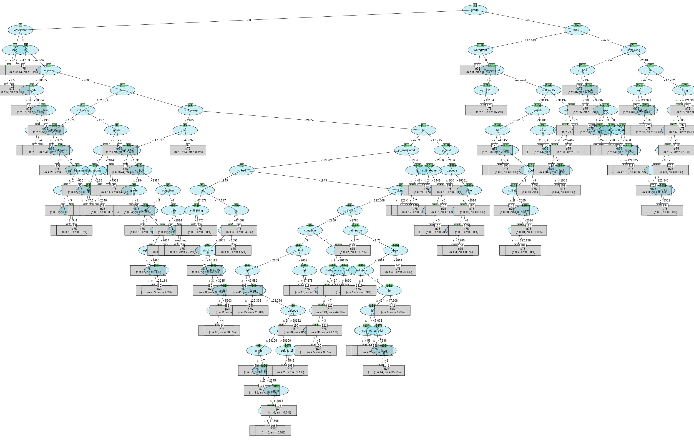
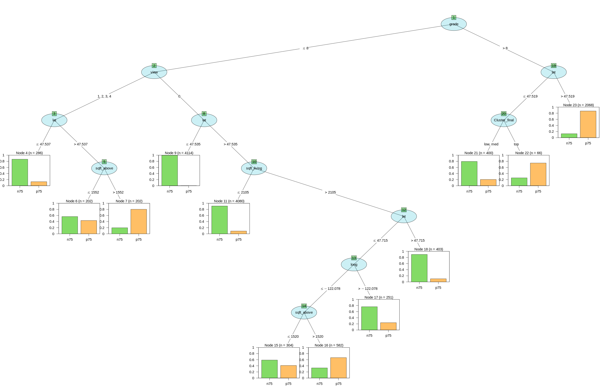

# Libraries and functions
## Libraries
```{r, echo=T, results='hide', message=FALSE}
# basics
library(dplyr)
library(ggplot2)
library(tidyr)
library(kableExtra)
# C50 tree
library(gmodels)
library(C50)
library(partykit)
library(caret)
library(lattice)
```


## Functions
```{r}
split_data <- function(data, trn = .6, tst = .2, val = .2) {
  set.seed(737)
  spec = c(train = trn, test = tst, validate = val)
  # cutter
  g = sample(cut(seq(nrow(data)), nrow(data)*cumsum(c(0,spec)), labels = names(spec)))
  # spliter
  data <- split(data, g)
  return(data)
}

p_barras <-function(df, dx, xlab){
p = ggplot(df, aes(unlist(dx), fill=unlist(dx))) +
  geom_bar(position="dodge", fill='#8bbabb', color="#464159") + 
  labs(x= xlab, y = 'Frecuencia', fill=NULL) +
  ggtitle("Diagrama de barras")
return(p)
}
```


# 1 Loading Data
## 1.1 Reading the Data from the CSV
```{r, reading csv}
file <- 'cluster.csv'
df_houses <-  read.csv(file)
head(df_houses) %>% kable() %>% kable_styling() %>% scroll_box(width = "100%", height = TRUE)
```
## 1.2 Adding a binary target
```{r, new_traget}
quantile <- df_houses$price %>% quantile(0.75)
df_houses$target <- ifelse(df_houses$price>quantile, 'p75', 'n75')
df_houses <- df_houses %>% select(6, 8:25, 28:29)
table(df_houses$target)
head(df_houses) %>% kable() %>% kable_styling() %>% scroll_box(width = "100%", height = TRUE)

```


# 2 Exploring preparing the data
## 2.1 Transforming data
```{r}
# Date as year
df_houses$date <- df_houses$date %>% as.Date("%m/%d/%Y") %>% format("%Y") %>% as.integer()
# waterfront and view as factor
df_houses$waterfront <- df_houses$waterfront %>% as.factor()
df_houses$view <- df_houses$view %>% as.factor()
# cluster to factor
df_houses$Cluster_final <- df_houses$Cluster_final %>% as.factor()
df_houses$target <- df_houses$target %>% as.factor()

head(df_houses) %>% kable() %>% kable_styling() %>% scroll_box(width = "100%", height = TRUE)
```

## 2.2 Spliting the data
```{r, splitting_data}
data <- split_data(df_houses)
train <- data$train
validation <- data$validate
test <- data$test

x_train <- train %>% select(-target)
y_train <- train$target
x_val <- validation %>% select(-target)
y_val <- validation$target
x_test <- test %>% select(-target)
y_test <- test$target
```


# 2 Decision tree model
## 2.1 Training the model C5.0
Entrenamos el árbol sobre training. Obtenemos un árbol de decisión con 121 niveles de profundidad.
```{r}
# The model
m_tree <- C5.0(x_train, y_train)
m_tree
# summary(m_tree)
```

Evaluation on training data (12958 cases):

	    Decision Tree   
	  ----------------  
	  Size      Errors  

	   121  766( 5.9%)   <<


	   (a)   (b)    <-classified as
	  ----  ----
	  9481   249    (a): class <p75
	   517  2711    (b): class >p75


	Attribute usage:

	100.00%	grade
	 99.63%	lat
	 84.04%	waterfront
	 61.48%	sqft_living
	 50.73%	zipcode
	 47.71%	view
	 21.15%	long
	 21.02%	yr_built
	  8.90%	yr_renovated
	  8.81%	condition
	  6.72%	sqft_above
	  4.19%	sqft_lot15
	  3.72%	bathrooms
	  3.61%	Cluster_final
	  3.56%	date
	  2.29%	bedrooms
	  2.27%	sqft_living15
	  2.05%	sqft_lot
	  0.69%	sqft_basement
	  0.23%	floors
	  
Podemos ver que las 3 variables que más condicionan la clasificación del modelo son la variable *grade* o nota del estado del inmueble la latitud *lat* y si tiene o no vistas a lago o mar.

## 2.2 Plotting the tree
```{r, include=F}
my_tree <- C50::as.party.C5.0((m_tree))
columncol<-hcl(c(270, 260, 250), 200, 30, 0.6)
labelcol<-hcl(200, 200, 50, 0.2)
indexcol<-hcl(150, 200, 50, 0.4)
# Plot all tree
png(filename="TreeCompleted.png", width=2500, height=1600, units = 'px',)
plot(my_tree, type = "simple", gp = gpar(fontsize = 10), drop_terminal = FALSE, tnex=1,
     inner_panel = node_inner(my_tree, abbreviate = FALSE, fill = c(labelcol, indexcol)),
     pval = TRUE, id = TRUE)
dev.off()
```


## 2.3 Evaluating the model performance on validation
```{r}
pred <- predict(m_tree, x_val)
table_train <- CrossTable(y_val, pred, prop.chisq = FALSE, prop.c = FALSE, prop.r = FALSE, dnn = c('Actual', 'Precicted'))

accuracy <- sum(diag(table_train$t))/sum(table_train$t)
output= sprintf("The test accuracy of the tree is: %s", accuracy)
print(output)
```

## 2.4 Understanding the tree
### Plotting the tree
A continuación se representa un corte del árbol anterior manteniendo la misma estructura para facilitar su comprensión.
```{r, include = FALSE}
m_tree_small <- C5.0(x_train, y_train, control = C5.0Control(minCases = 200))
columncol<-hcl(c(270, 260, 250), 200, 30, 0.6)
labelcol<-hcl(200, 200, 50, 0.2)
indexcol<-hcl(150, 200, 50, 0.4)

my_tree <- C50::as.party.C5.0(m_tree_small)
# Plot Right branch
png(filename="TreeSmall.png", width=2500, height=1600, units = 'px')
plot(my_tree, type = "simple", gp = gpar(fontsize = 15), drop_terminal = FALSE, tnex=1,
     inner_panel = node_inner(my_tree, abbreviate = FALSE, fill = c(labelcol, indexcol)),
     pval = TRUE, id = TRUE, terminal_panel=node_barplot(my_tree, col = "black", fill = columncol[c(1,2,4)],
     beside = TRUE, ymax = 1, ylines = TRUE, widths = 1, gap = 0.1))
dev.off()
```


Podrímos concluir lo siguiente a partir de este gráfico:

- Que la mayoría de las viviendas dependen de su variable grade.

- Que aquellas que tienen un *grade* > 8 dependen en su mayoría de su ubicación.

- Que las viviendas con notas más bajas y mala ubicación, dependen mucho de su superficie.

### Declaring rules
Los árboles de decisión pueden ser difíciles de interpretar. Una opción que permite la librería C5.0, es la creación de *rulesets*, una collección de reglas que funcionan como clasificadores. Estas reglas facilitan el entendimiento del árbol de decisión.
```{r}
m_tree_rules <- C5.0(x_train, y_train, rules = T)
# summary(m_tree)
```

Dentro de cada regla podemoss ver el número de viviendas en los que el clasificador acierta y en cuales falla (2327/7, lift 1.3), el lift se estima mediante el ratio de Laplace (n-m+1)/(n+2). A continuación se exponen las reglas, al final se declara la clase a la que pertenece y un valor de confianza en la predicción.

- Rule 1: (2327/7, lift 1.3) </br>
zipcode <= 98105
lat <= 47.4552
sqft_lot15 <= 36497
Cluster_final in {low, med} </br>
->  class <p75  [0.997]
	

- Rule 2: (2906/11, lift 1.3) </br>
bathrooms <= 2.25
waterfront = 0
grade <= 7
lat <= 47.5685  </br>
->  class <p75  [0.996]

- Rule 6: (79, lift 1.3) </br>
lat > 47.7319
long > -121.997 </br>
->  class <p75  [0.988]

- Rule 10: (372/16, lift 1.3) </br>
sqft_above <= 3160
long > -121.921 </br>
->  class <p75  [0.955]
	
- Rule 13: (10424/1296, lift 1.2) </br>
grade <= 8 </br>
->  class <p75  [0.876]
	
# 3 Improving the model performance
## 3.1 Boosting the accuracy
La función c5.0() nos permite añadir boosting al árbol de decisión mediante el parámetro *trials*. *trials* limita el número de árboles añadidos. Un buen parámetro estándar inicial reconocido para boosting es de 10, ya que algunas investigaciones situan la reducción del error en un 25%. En este caso, ya que el modelo tarda muy poco en ejecutarse probaremos 7 valores diferentes de boosting.

```{r}
set.seed(737)
trials <- c(5, 10, 15, 20, 25, 30, 40)
results <- c()
for (trial in trials) {
  m_tree_boost <- C5.0(x_train, y_train, trials = trial)
  tree_pred <- predict(m_tree_boost, x_val)
  cm <- table(tree_pred, y_val)
  accuracy <- sum(diag(cm))/sum(cm)
  results <- c(results, accuracy)
}
df_boost <- data.frame(trials = trials, accuracy = results)
df_boost
```
```{r}
ggplot(data = df_boost, aes(trials, accuracy)) + geom_path(color='grey') + geom_point(color = 'black') + geom_point(color = 'red', size=3, aes(trials[4], accuracy[4])) + labs(title='Boosting trials VS accuracy')
```

```{r}
m_tree_boost_20 <- C5.0(x_train, y_train, trials = 20)
```


```{r}
library(pROC)
pred <- predict(m_tree_boost_20, x_val)
prob <- predict(m_tree_boost_20, x_val, type='prob')[, 'p75']
table_train <- CrossTable(y_val, pred, prop.chisq = FALSE, prop.c = FALSE, prop.r = FALSE, dnn = c('Actual', 'Precicted'))

accuracy <- sum(diag(table_train$t))/sum(table_train$t)
output= sprintf("The test accuracy of the tree is: %s", accuracy)
print(output)
```


```{r}
library(RMark)
# mymodel=mark(m_tree_boost,threads=1)
# export.model(m_tree_boost, replace = FALSE)
# data(m_tree_boost)
# mymodel=mark(dipper,threads=1)
# export.model(mymodel,replace=TRUE)
```


